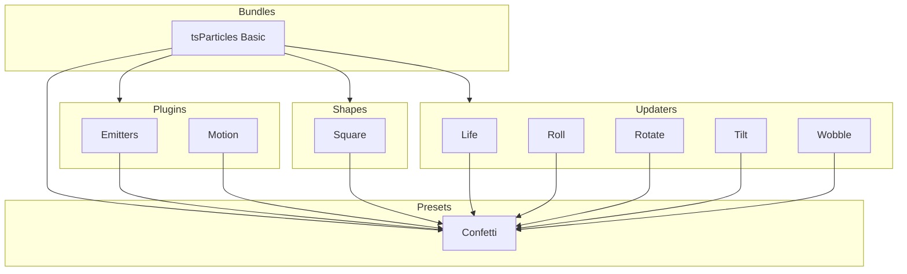

[](https://particles.js.org)

# tsParticles Confetti Preset

[](https://www.jsdelivr.com/package/npm/@tsparticles/preset-confetti) [](https://www.npmjs.com/package/@tsparticles/preset-confetti) [](https://www.npmjs.com/package/@tsparticles/preset-confetti) [](https://github.com/sponsors/matteobruni)

[tsParticles](https://github.com/tsparticles/tsparticles) preset for white and red confetti launched from the screen
center on a transparent background.

[](https://join.slack.com/t/tsparticles/shared_invite/enQtOTcxNTQxNjQ4NzkxLWE2MTZhZWExMWRmOWI5MTMxNjczOGE1Yjk0MjViYjdkYTUzODM3OTc5MGQ5MjFlODc4MzE0N2Q1OWQxZDc1YzI) [](https://discord.gg/hACwv45Hme) [](https://t.me/tsparticles)

[](https://www.producthunt.com/posts/tsparticles?utm_source=badge-featured&utm_medium=badge&utm_souce=badge-tsparticles") <a href="https://www.buymeacoffee.com/matteobruni"></a>

## Sample

[](https://particles.js.org/samples/presets/confetti)

## How to use it

### CDN / Vanilla JS / jQuery

```html
<script src="https://cdn.jsdelivr.net/npm/@tsparticles/preset-confetti@3/tsparticles.preset.confetti.bundle.min.js"></script>
```

### Usage

Once the scripts are loaded you can set up `tsParticles` like this:

```javascript
tsParticles.load({
  id: "tsparticles",
  options: {
    preset: "confetti",
  },
});
```

### Customization

```javascript
tsParticles.load({
  id: "tsparticles",
  options: {
    particles: {
      color: {
        value: ["#0000ff", "#00ff00"],
      },
    },
    preset: "confetti",
  },
});
```

Like in the sample above, the white and red colors will be replaced by blue and lime.

#### Cannons

The preset has a single life cannon, with a short duration. The effect is immediate and ends few seconds after, but this
can be customized too.

The confetti cannons are made using the _Emitter_ plugin, which is already
documented [here](https://particles.js.org/docs/classes/Plugins_Emitters_Options_Classes_Emitter.Emitter.html).

These are the default cannon (emitter) options:

The default emitter options are these:

```json
{
  "startCount": 50,
  "position": {
    "x": 50,
    "y": 50
  },
  "size": {
    "width": 0,
    "height": 0
  },
  "rate": {
    "delay": 0,
    "quantity": 0
  },
  "life": {
    "duration": 0.1,
    "count": 1
  }
}
```

Let's see how to create the most common types of cannon animations:

##### Long lasting Cannon

To create a long-lasting cannon, the emitter life options need some changes.

The `life.duration` needs to be increased, the value is in `seconds`, so actually it lasts one tenth of a second.

If `life.duration` is set to `0`, the cannon will last forever.

The `life.count` parameter instead can be changed as well, but the animation will last for the specified
duration, `life.count` times, if the `life.duration` is set to `0`, the `life.count` is ignored since its first life
will last forever.

###### Sample

```javascript
tsParticles.load({
  id: "tsparticles",
  options: {
    emitters: {
      life: {
        duration: 0,
      },
    },
    preset: "confetti",
  },
});
```

This will create an infinite cannon shooting confetti from the center of the canvas.

##### Immortal Cannon - Fireworks

To create a fireworks effect, or an immortal cannon, the emitter life options, again, need some changes.

The `life.duration` can be kept to the default short value, but the `life.count` is what we need to change.

For an immortal cannon we can change `life.count` to `0` and the emitter will continue respawning every `life.delay`
seconds. Actually is not specified, if you want some delay between "explosions", set this value to something greater
than `0`.

For an improved effect, the `position` as well can be customized. For randomizing it, it can be set to `{}`, and it'll
have a random position every "explosion". If a coordinate is set, that will be used everytime, as a percentage of the
canvas size.

```javascript
tsParticles.load({
  id: "tsparticles",
  options: {
    emitters: {
      life: {
        count: 0,
      },
      position: {
        // uncomment only one of these lines,
        // to have explosions on the x or y axis
        // centered on the other one
        // if everything is kept commented,
        // random positions will be used everytime the cannon fires
        // x: 50,
        // y: 50
      },
    },
    preset: "confetti",
  },
});
```

###### Multiple Cannons

Now that we have played with a single cannon, what about multiple ones?

This needs more customization since the cannons array will overwrite the existing options.

First let's start overriding the emitters (cannons) options placing an array instead of an object.

Like this:

```javascript
tsParticles.load({
  id: "tsparticles",
  options: {
    emitters: [],
    preset: "confetti",
  },
});
```

If you test this, you won't see anything, because the emitters are set to an empty array, so there's nothing to show.

Now you can add emitters to the array, using the standard tsParticles emitters options.

###### Sample

```javascript
tsParticles.load({
  id: "tsparticles",
  options: {
    emitters: [
      {
        life: {
          duration: 5,
          count: 1,
        },
        position: {
          x: 0,
          y: 30,
        },
        particles: {
          move: {
            direction: "top-right",
          },
        },
      },
      {
        life: {
          duration: 5,
          count: 1,
        },
        position: {
          x: 100,
          y: 30,
        },
        particles: {
          move: {
            direction: "top-left",
          },
        },
      },
    ],
    preset: "confetti",
  },
});
```

This samples creates two cannons, one on the left and one on the right of the canvas, at 30% of canvas height, shooting
in opposite directions.

### Frameworks with a tsParticles component library

Checkout the documentation in the component library repository and call the `loadConfettiPreset` function instead of `loadFull`, `loadSlim` or similar functions.

The options shown above are valid for all the component libraries.

---


