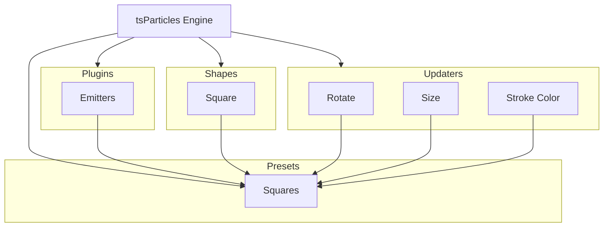

[](https://particles.js.org)

# tsParticles Squares Preset

[](https://www.jsdelivr.com/package/npm/@tsparticles/preset-squares) [](https://www.npmjs.com/package/@tsparticles/preset-squares) [](https://www.npmjs.com/package/@tsparticles/preset-squares) [](https://github.com/sponsors/matteobruni)

[tsParticles](https://github.com/tsparticles/tsparticles) preset creating a squares effect with falling particles.

[](https://discord.gg/hACwv45Hme) [](https://t.me/tsparticles)

[](https://www.producthunt.com/posts/tsparticles?utm_source=badge-featured&utm_medium=badge&utm_souce=badge-tsparticles") <a href="https://www.buymeacoffee.com/matteobruni"></a>

## Sample

[](https://particles.js.org/samples/presets/squares)

## How to use it

### CDN / Vanilla JS / jQuery

```html
<script src="https://cdn.jsdelivr.net/npm/@tsparticles/preset-squares@3/tsparticles.preset.squares.bundle.min.js"></script>
```

### Usage

Once the scripts are loaded you can set up `tsParticles` like this:

```javascript
(async () => {
  await loadSquaresPreset(tsParticles);

  await tsParticles.load({
    id: "tsparticles",
    options: {
      preset: "squares",
    },
  });
})();
```

#### Customization

**Important ⚠️**
You can override all the options defining the properties like in any standard `tsParticles` installation.

```javascript
tsParticles.load({
  id: "tsparticles",
  options: {
    particles: {
      shape: {
        type: "circle", // starting from v2, this require the circle shape script
      },
    },
    preset: "squares",
  },
});
```

Like in the sample above, the circles will be replaced by squares.

### Frameworks with a tsParticles component library

Checkout the documentation in the component library repository and call the `loadSquaresPreset` function instead
of `loadFull`, `loadSlim` or similar functions.

The options shown above are valid for all the component libraries.

---


